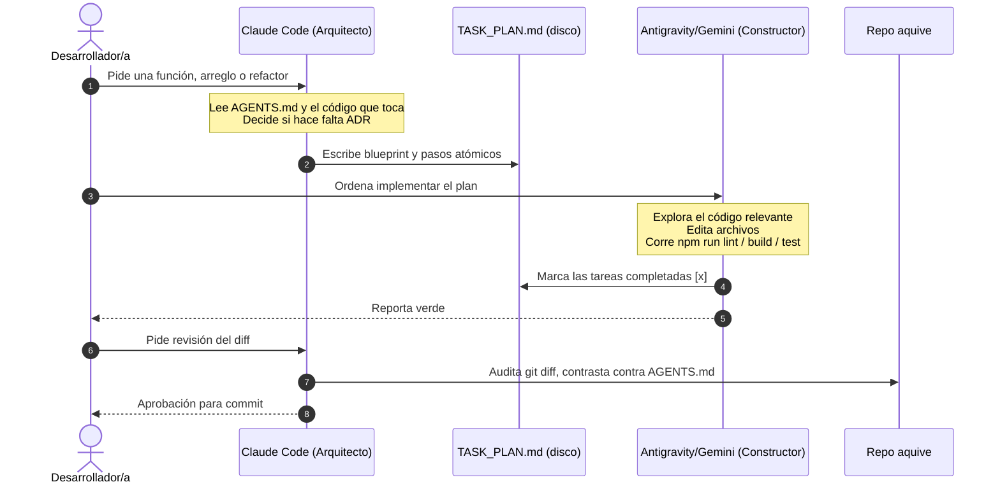

# Protocolo de orquestación multiagente: Claude Code & Antigravity/Gemini

Este documento fija el marco operativo para la colaboración entre **Claude
Code** (`claude`) y **Antigravity/Gemini CLI** (`agy` o `gemini`) en el
repositorio de AquíVe. A diferencia de Coffea, AquíVe es **un solo repo**
Next.js — no hay backend y frontend separados —, así que la coordinación no
es entre repos: es entre roles sobre los mismos archivos.

---

## 1. Por qué dos IA y no una

| Dimensión | Claude Code | Antigravity / Gemini |
| --- | --- | --- |
| Ventana de contexto | Más ajustada, alta sensibilidad a saturación | Mucho más grande, tolera exploración amplia del código |
| Fortaleza | Razonamiento arquitectónico, detectar cuándo una tarea contradice `AGENTS.md` o necesita ADR, contratos limpios | Búsqueda exhaustiva en el código, bucles de build/lint/test, corrección autónoma |
| Rol asignado | **Tech Lead / Arquitecto** | **Senior Developer / QA** |

El objetivo es el mismo que en Coffea: que el arquitecto no queme su
contexto leyendo decenas de archivos de implementación completa, y que el
constructor no tome decisiones de producto o de arquitectura por su cuenta.

## 2. Matriz de responsabilidades



### Rol 1 · Claude Code (el arquitecto)

Qué hace:
1. Lee el requerimiento contra `AGENTS.md` (reglas legales, de producto, de
   arquitectura e interfaz) y contra el código que va a tocar.
2. Decide si la tarea contradice `AGENTS.md` y necesita un ADR primero
   (`docs/decisiones/LEEME.md` fija el criterio).
3. Define el contrato — procedimiento oRPC, esquema Zod, forma de los datos —
   y las reglas de negocio que aplican.
4. Escribe el plan de ejecución en `TASK_PLAN.md`, con pasos atómicos e
   imperativos.
5. Audita el `git diff` final antes de cada commit.

Qué NO hace, salvo que se le pida explícitamente:
- No corre `npm run build`, `npm run lint` ni la suite de pruebas.
- No escribe la implementación completa de principio a fin.
- No decide una categoría nueva de oficio, un `ON DELETE` distinto o
  cualquier otra cosa que `AGENTS.md` dice que sale de un ADR — eso se
  pregunta o se escribe como ADR antes de tocar código.

### Rol 2 · Antigravity / Gemini (el constructor)

Qué hace:
1. Lee el plan desde `TASK_PLAN.md` (o el prompt directo del blueprint).
2. Explora las dependencias reales en `src/server/`, `src/app/` y
   `src/components/` con su ventana de contexto más amplia.
3. Implementa los archivos, siguiendo el contrato y las rutas exactas que fijó
   el arquitecto.
4. Corre `npm run lint`, `npm run build` y las pruebas relevantes en bucle
   hasta pasar en verde, corrigiendo autónomamente sin detenerse a preguntar
   ante el primer error.
5. Actualiza los checkboxes de `TASK_PLAN.md`.

Qué NO hace:
- No cambia decisiones de arquitectura, contratos o reglas de `AGENTS.md`
  sin que estén aprobadas en el plan.
- No publica algo que necesitaba ADR sin que exista el ADR.

## 3. Memoria compartida: `TASK_PLAN.md`

En la raíz del repo, `TASK_PLAN.md` es el tablero de coordinación:

```markdown
# TASK_PLAN: [Título de la tarea]

**Estado:** [EN PROGRESO / COMPLETADO / REVISIÓN]
**Arquitecto:** Claude Code
**Constructor:** Antigravity / Gemini

## 1. Decisiones y contrato
- [Procedimiento oRPC, forma del payload, reglas de negocio, ADR si aplica]

## 2. Pasos de implementación (Antigravity/Gemini)
- [ ] 1. Esquema/migración si hace falta
- [ ] 2. Dominio en `src/server/<dominio>/`
- [ ] 3. Procedimiento del contrato oRPC
- [ ] 4. UI / Server Component / Client Component
- [ ] 5. `npm run lint` y `npm run build` en verde

## 3. Criterios de aceptación
- Cumple las reglas de `AGENTS.md` que apliquen (legales, de producto, de
  interfaz).
- Build y lint limpios.

## 4. Notas y bloqueos
- [Hallazgos o decisiones reportadas por el constructor]
```

`TASK_PLAN.md` no se versiona a propósito para cada tarea — es un tablero de
trabajo en curso, no un historial. Se puede añadir a `.gitignore` si empieza a
ensuciar los diffs; si el equipo prefiere conservarlo como bitácora, eso es
decisión del responsable, no de este documento.

## 4. Formato de commit por rol

Este repo usa **Conventional Commits en español** (`feat:`, `fix:`, `docs:`,
`refactor:`…) con el cuerpo explicando el porqué, no el bracket de Coffea.
Lo que cambia por rol es solo la línea de coautoría al final:

- Claude Code: `Co-Authored-By: Claude <modelo> <noreply@anthropic.com>`
- Antigravity / Gemini: `Co-Authored-By: Antigravity <noreply@google.com>`

Ningún commit se hace con build o pruebas en rojo.

## 5. Prompts base

- Arquitecto (Claude Code):
  [`prompts/claude-architect.prompt.md`](prompts/claude-architect.prompt.md)
- Constructor (Antigravity/Gemini):
  [`prompts/antigravity-builder.prompt.md`](prompts/antigravity-builder.prompt.md)

## 6. Qué no cambia de `AGENTS.md`

Ninguna IA — arquitecto o constructor — se salta el mínimo legal, las reglas
de producto o el criterio de ADR por eficiencia de tokens. Este protocolo
organiza *quién hace qué*, no relaja ninguna regla de `AGENTS.md`. Ante duda,
gana `AGENTS.md` y se pregunta antes de asumir.
